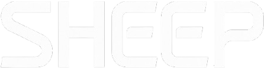

 

# Grounding the Agentic Future

We are on the verge of a paradigm shift. Large Language Models (LLMs) have solved the reasoning problem, but reasoning, alone, operates in a vacuum. Artificial intelligence without reliable, structured, and deterministic access to data reality is a powerful engine spinning its wheels.

Today, AI Agents are promising but fragile. They hallucinate APIs, forget code context, and struggle to query enterprise databases. The bottleneck is no longer the model's intelligence; it is information logistics.

Sheep was born to solve this problem. We don’t build the brain; we build the nervous system.

## Our Core Belief: Intelligence Needs Roots

To develop AGI—or even just an autonomous software agent society—we don't need a bigger model. We need better access to raw, static data.

Agents must stop "reading" code and data as plain text and start "understanding" them as logical structures. Our mission is to provide the infrastructure layer (Retrieval & Tooling) that transforms repositories, databases, and documentation into actionable knowledge for agents.

**If LLMs are the processors, Sheep is the system bus.**

## The Sheep Stack

We are developing a suite of modular and composable libraries, designed to be the fundamental primitives with which developers will build their autonomous "Software Houses".

### 1. Crader: The Codebase Cortex
[https://github.com/sheeptechnologies/crader](https://github.com/sheeptechnologies/crader)

**Enterprise-Grade Code Intelligence for AI Agents.**

Crader is a production-ready codebase indexer that transforms source code into a queryable Code Property Graph (CPG) enriched with semantic embeddings. Built specifically for agentic workflows, it moves beyond text search to give agents a structural understanding of the software. It enables deep analysis, intelligent retrieval, and the ability to navigate complex dependencies with zero hallucinations.

### 2. Crook: The Data Interface
[https://github.com/sheeptechnologies/crook](https://github.com/sheeptechnologies/crook)

**Grounding logic in data reality.**

The bridge between fluid reasoning and rigid SQL structures. Crook transforms database schemas into cognitive maps, allowing agents to "understand" the business domain hidden in the tables. It empowers agents to autonomously explore data layouts, define custom business metrics, and execute queries with structural precision.

### 3. Collie: The MCP Manager
[https://github.com/sheeptechnologies/collie](https://github.com/sheeptechnologies/collie)

**Dynamic Skill Discovery & Fabrication.**

Collie is the Model Context Protocol (MCP) manager that acts as the central dynamic registry for agent capabilities. It functions as a smart router for tool execution: it searches for the right skill for the task, and if a required capability is missing, Collie triggers "Code Mode" to autonomously generate, test, and register the new tool on the fly.

### 4. Silo: The State Anchor
[https://github.com/sheeptechnologies/silo](https://github.com/sheeptechnologies/silo)

**Persistence & Connection Management.**

Agents are ephemeral; Silo provides the continuity. It serves as the system's long-term memory and operational backbone. Silo manages secure connection pools to databases, serializes agent state to disk, and persists the "project context" across sessions, ensuring that the system picks up exactly where it left off.

### 5. Grazer: The Control Plane
[https://github.com/sheeptechnologies/grazer](https://github.com/sheeptechnologies/grazer)

**The unified CLI for the ecosystem.**

Grazer is the global interface that orchestrates the entire Sheep stack. It abstracts the complexity of the underlying libraries, providing a single, unified entry point (CLI/API) to command Crader’s indexing, Crook’s data retrieval, Collie’s skill fabrication, and Silo’s state management. It is the bridge between the user and the swarm.

## The Vision: A Society of Agents

We envision an ecosystem where:

*   **Grazer** orchestrates the mission, translating user intent into swarm directives.
*   **Collie** equips agents with the right skills, discovering or fabricating tools as needed.
*   **Crader** gives agents structural mastery over the codebase to implement features safely.
*   **Crook** ensures every decision is grounded in real production data and business metrics.
*   **Silo** preserves the "stream of consciousness," allowing agents to pause, resume, and collaborate over long horizons.

To make this future possible, agents must have better tools than humans, not worse. They must be able to "touch" raw data.

**Sheep provides these tools. We are building the foundations upon which agents will build tomorrow's software.**
